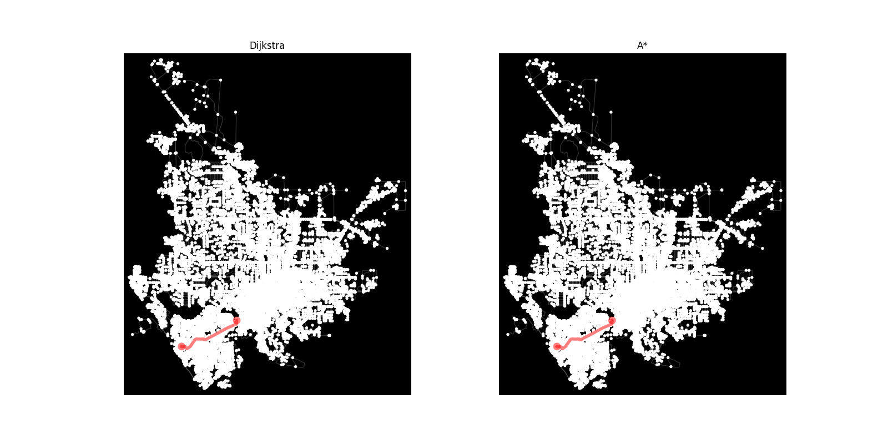

# Installation

Our project used [uv](https://docs.astral.sh/uv/) as our package manager. All dependencies can be installed from the pyproject.toml file, using uv or standard pip.

First, clone the repository using
```
git clone https://github.com/nonagaga/COP3530_Project2.git
```

Then, enter the cloned directory.

### UV Installation

```
uv sync
```

### Pip Installation

```
pip install .
```

# Usage

To use our A* and Dijkstra Route Finding comparison, open and run the User Interface (UI.py) program. This program will prompt the user to enter a city and state. It will then check to see if the route data for that city has already been downloaded; if not, it will download the data through OSMNX's built-in fetcher that uses OpenStreetMap's database and compress it to a pickle file for quicker future use. Then it will select two random nodes in that city, and run both the A* and Dijkstra algorithms on each. After doing so, it will pull up a side-by-side comparison of the two routes and print the distance, runtime, and total search iterations for each algorithm to the terminal for further comparison.

### Example
```
Enter City Name: 
Gainesville

Enter State: 
Florida
Looking for cached graph...
Found cached graph!
Nodes: 34202, Edges 95086

Dijkstra route distance: 3,982.666453 meters
Dijkstra route finding time: 0.153973 seconds
Dijkstra search iterations: 7557

Astar route distance: 3,982.666453 meters
Astar route finding time: 0.094515 seconds
Astar search iterations: 2236

Plotting routes (this also might take a while)...
```


